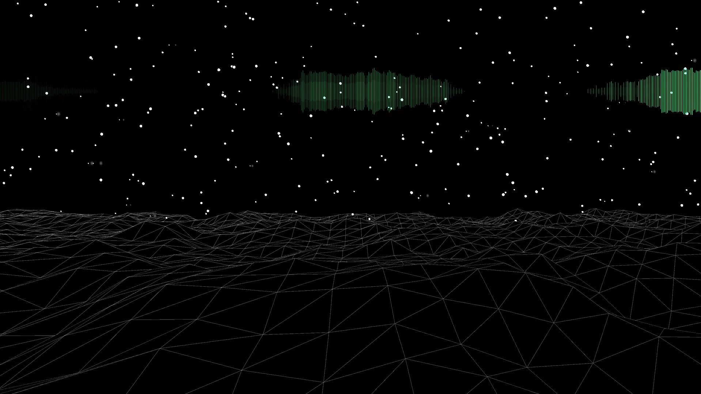
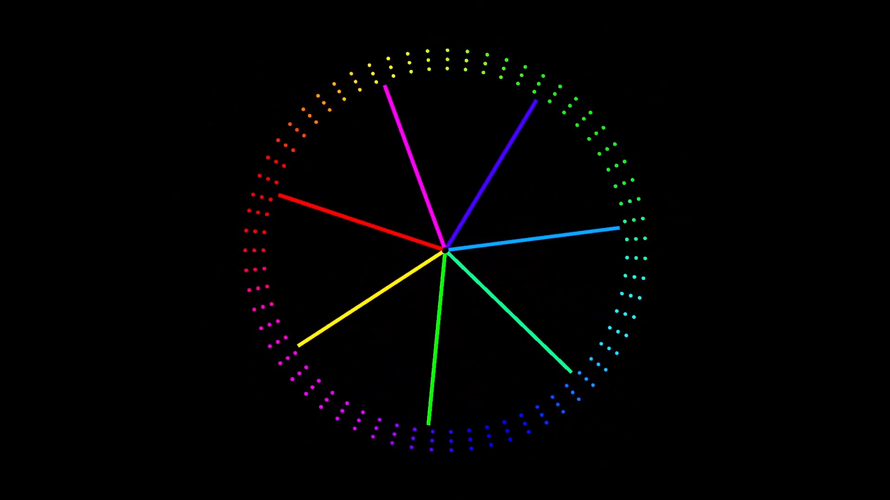
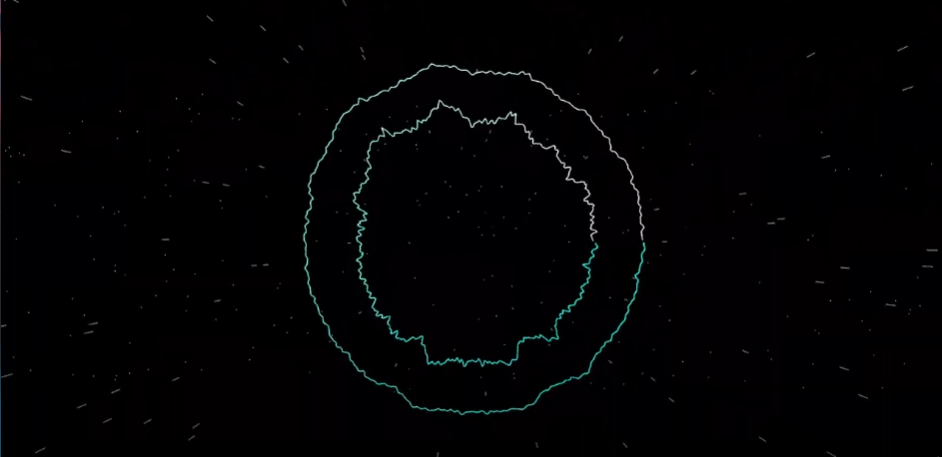
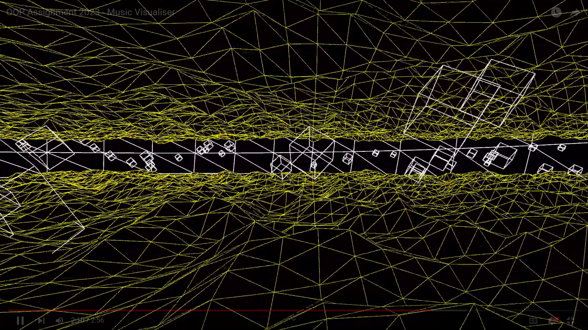

# Music Visualiser Project
----
# Youtube Video of Our Project

----
# Group Members
| Name | Student Number |
|-----------|-----------|
|Cian McKenna | C21755919 |
|Ian Hipolito | C21436494 |
|Josua Flores | C21352183 |

----

# Description of the assignment
In this assignment we have a total of 5 different scenes that use Java Processing.
The song we chose for this assignment is "starryeyed" by Ellie Goulding. We felt this song gave us good oppurtunties to create a narrative within our video and of course gave us many visualization oppurtunites. All of our visualisations respond to the amplitude and frequency of the music, this is doen through the minim library.

----
# Instructions
- Compile and run main.java from ie.tudublin package
- In order of appearance = {Scene1(Cian), Scene2(Ian), Scene3(Cian & Ian), Scene4(Joshua), Scene5(Joshua), , Scene1(Cian)}
----
# How it works
- We created a folder for each team members scene's, these folders are named with our student numbers. 
- We then have a main file which is used to run all of our visualtions this file is called MainVisual, this is an extend of the Visual file.
- The MainVisual file starts the music and calls the needed methods from the visual file, such as getAmplitude.
----
## Cian McKenna
- I created the opening scene of the project, this scene is meant to resemble an stary night sky aong with shooting stars and northern lights to visualise the music, also with moving terrain in the foreground.
- To create this scene I created a randomly generated stars to fill up the sky, this is done through creating an arraylist of different parameters such as StarNum, x, y, StarReact, these parameters would all have random values to look more realistic. The northern lights visulizer is made by using by getting the size of amplitude in the audio player and creating lines that are controlled by the lerped buffer. The terrain is created by creating an array which changes values based on the noise function.

- The next scene I was involved in was scene 3, I worked on these scene with Ian and we created a visual that mathced the lyrics of the song(Carousels of Color)
-How this was acheieved was by creating 5 different lines who's lenght and thickness is effected by the amplituded of the music, this is meant to represent the rides you would see on a carousel, we then added an outside ring of points which would rotate to give use the overall carousel shape, this is done through a TWO_PI loop and various points with different variables.

----

## Ian Hipolito
- I created one visulisation scene and worked with Joshua and Cian with two visulisation scenes.
- The first visualisation I worked on is the scene with the two shapes (circles) and the stars. It renders a visual scene of stars (800 star objects) based on the audio input. The stars are randomly mapped and are updated and displayed. I randomly positioned the stars to make the scene look visually better as having the stars come out in the same position and not static everytime they are displayed would ruin the scene in my personal opinion. I also create shapes that are manipulated based on the audio input. I used trigonmetric functions and lerping for the position and to insure that the transitions are smooth.

- The second visulisation I worked on is the third scene. I worked on this seen with my other group member Cian. This scene consists of rotating lines and circular shape (carousel) made up of dots, both are affected by the amplitude and react to the audio input. We spent a lot of time on how much the shapes react to the music as we did not want the length of the lines to surpass the carousel when it reacts to the audio, but in the end after lots of trial and error we managed to get to where we were both happy with it.

----

## Joshua Flores
- The first scene that I created involved the use of 2 perlin noise generated terrains, which contained an array of cubes that would slowly move towards the camera, and a background formed by a large circle. The terrains were formed by creating a 2D flat triangle strip mesh. After creating the flat triangle strip mesh, the z axis of each vertex on the mesh is allocated using perlin noise, which allocates each z axis smoothly, forming the wave like terrain. The terrains also react to the music, affecting how high the z axis can be allocated. The louder the music, the taller the terrain. The speed at which the terrain moves forward is also impacted by the amplitude of the music, the louder the music, the faster the terrain.
- For the array of cubes, I used a for loop to randomly allocate the x, y, and z position for each cube. Each cube would slowly rotate, and the speed at which the cubes move towards the camera is determined by the amplitude of the music.
Lastly, I used a large circle to encase the entire scene, adding more to the blank background.

- The next visual I worked on was the Sunset with the valley. Ian created the Sun element of the visuals, which I incorporatde into the scene. The sun is slimply an ellipse with a gradient of colours. The slits which travel over the sun are created using Rectangles, which form and update their position. As they move higher along the sun, the slits become smaller and smaller, creating a cool effect. The speed that the slits move is affected by the amplitude of the music, moving faster as the music becomes louder. 
- The terrain in this scene is also formed using perlin noise. But in this case, the terrain is divided into different sections. Each section has its own max height which the perlin noise can go to, allowing for a dynamic terrain structure. With the center having the lowest max height, the further you travel outwards along the y axis, the taller the terrain becomes. Like the other scenes, the louder the music,the faster the terrain moves.

# What I am most proud of in the assignment
----
## Cian McKenna
- Overall I'm very pleased with the way our project turned out, since in the middle of the project I felt the video lacked direction but we managed to create something good.
- Also learning java, definetly please with how much experience this project has given me in java and working through all the many errors that we got.

## Ian Hipolito
- Gaining a better understanding of object orientated programming concepts.
- How to map and position objects on the screen better.
- Gaining valuable team collaboration skills working as group in order to help code the scenes together and solve problems that would have taken longer to solve without another person looking at your code.

